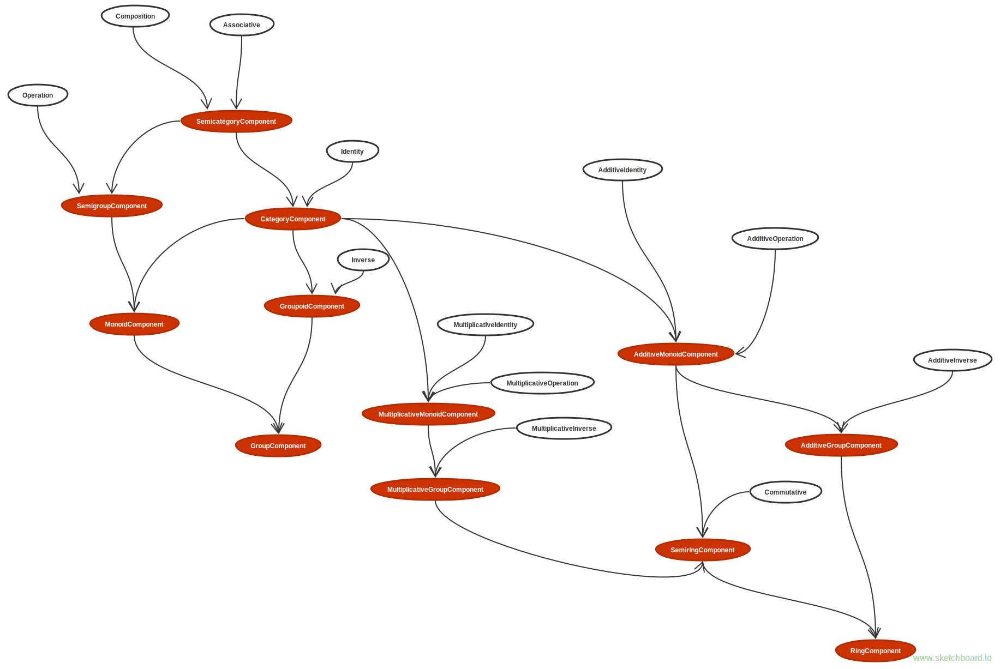

## Architector: Algebra

This is a small part of a project called Architector, which suppose to help Dotty programmers to get rid of a big piece of boilerplate.

The library containts traits describing algebraic structures in a categorial theoretic sense. 
Such as:

- Category
- Semicategory
- Semigroup
- Monoid
- Groupoid
- Group
- Ring

and others.

### Library Design

It was decided to refuse usual practice of typeclass inheritance because of knows [issues](https://typelevel.org/blog/2016/09/30/subtype-typeclasses.html).

All properties were moved to usual traits in algebra/stones and bricks folders. They inherite from each other in a usual way.
The structure is described in a diagram below.



It is easy to extend usual traits for creating custom typeclasses.

### Getting Started

Many examples are in the instance folder and tests. 

Create an instance:

```scala
    implicit def intRing: Ring[Int] = new Ring[Int] {

        override def zero: Int = 0

        override def add(a: Int, b: Int): Int = a + b 

        override def one: Int = 1

        override def mult(a: Int, b: Int): Int = a * b    

        override def negation(a: Int): Int = -a 
    }
```
